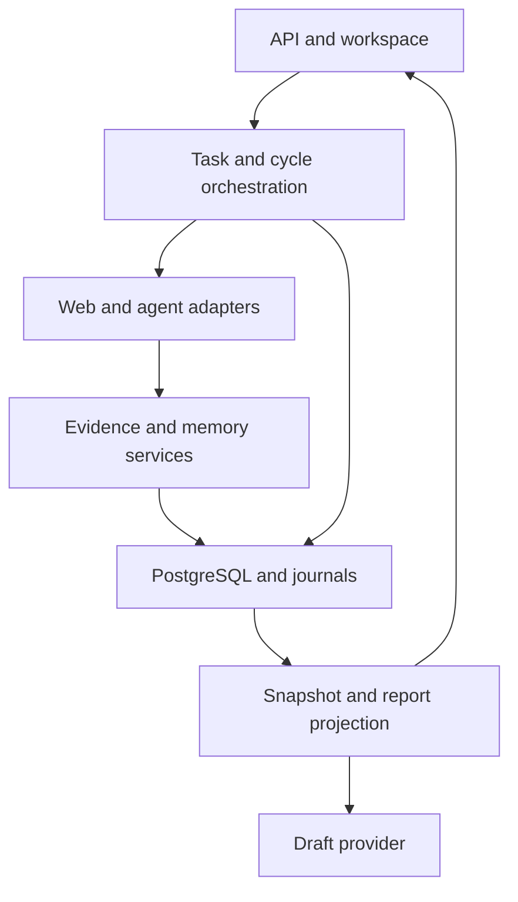

# Gnomon architecture and deep code review

Review date: 15 September 2026. Repository: [SkillSpringAI/Gnomon](https://github.com/SkillSpringAI/Gnomon).

Pinned baseline: [`8a220523a9d2808b30d3fe94bbcd5f4ad0c2a580`](https://github.com/SkillSpringAI/Gnomon/tree/8a220523a9d2808b30d3fe94bbcd5f4ad0c2a580). Findings apply to this commit, not an unpinned future main branch. No repository source changes or GitHub writes were made.

## Verdict

Keep the current architecture. Its deterministic services, explicit provenance, governed memory journal, and separation between evidence collection and operator review are worth preserving. The main weaknesses are incomplete transaction and execution lifecycles, inconsistent configuration paths, and verification that misses the actual installation/runtime configuration.

I would fix the release gate and provider accounting before expanding live provider or agent execution. This review identifies eight findings: three P1 and five P2. P1 means address before expanding external execution or release; P2 means a concrete correctness or contract defect for the next hardening pass. Severity is contextual: the memory backend is developmental, and wheel packaging does not break the documented editable checkout installation.

## Evidence and limits

| Check | Result |
| --- | --- |
| GitHub baseline | Plugin tree lookup and local checkout matched the full SHA above |
| Latest CI for this SHA | Failed at mypy; migration and pytest steps were skipped |
| Local editable installation with dev extras | Succeeded |
| Ruff | Passed |
| Mypy | Failed with the same four missing-import/unused-ignore errors as CI |
| Repository unit suite | 112 passed |
| Additional characterization probes | Five passed, confirming current defects or boundary behavior, not confirming fixes |
| Built wheel | Built successfully; contained zero SQL migrations; its migration discovery returned zero files |
| Authority traceability script | Passed; explicitly does not establish behavioral or release conformance |
| Full pytest suite | Blocked during collection by unavailable local PostgreSQL |

Local Python was 3.12; GitHub CI used 3.11. No live Bedrock requests or outbound agent messages were sent. Browser interactions, a PostgreSQL concurrency run, backup restoration, and a complete semantic audit of all ten authority documents were not performed. Database interleavings below are code-derived findings, explicitly distinguished from reproduced behavior.

Reviewed paths include API composition, task/cycle lifecycle and recovery, source and agent runners, extraction, memory mutation/reversal, persistence and migrations, planning/report projections, provider sessions/budgets/adapters, HTTP retrieval controls, workspace rendering, and relevant tests/docs. This is a targeted deep review of the principal paths, not a claim that every line or possible execution was verified.

## Findings

### F1 · P1 · The current CI configuration never reaches migrations or tests

**Evidence:** [workflow](https://github.com/SkillSpringAI/Gnomon/blob/8a220523a9d2808b30d3fe94bbcd5f4ad0c2a580/.github/workflows/quality.yml), [Bedrock imports, lines 25–27](https://github.com/SkillSpringAI/Gnomon/blob/8a220523a9d2808b30d3fe94bbcd5f4ad0c2a580/src/research_agent/adapters/llm/bedrock_report.py#L25-L27), and [failed CI run](https://github.com/SkillSpringAI/Gnomon/actions/runs/34911570539).

The workflow installs `.[dev]`, but boto3 is only in `.[aws]`. Mypy checks the Bedrock module anyway. Its `type: ignore[import-untyped]` comments do not cover `import-not-found`, and strict checking also reports those comments as unused. The four errors were reproduced locally and read directly from the CI job log.

**Impact:** the current release gate supplies no migration or integration-test result. This is not evidence that those tests fail, but it is also not a green baseline.

**Repair:** install and type-check the intended AWS dependency set in the quality job, or configure the optional-import boundary explicitly. Preserve a separate minimal-install check. Avoid a blanket suppression of missing imports.

**Acceptance:** a clean CI installation passes mypy and actually executes migrations and pytest. Show skipped-test counts separately.

### F2 · P1 · Expiry can refund capacity while a provider call is still running

**Evidence:** [reservation and completion, lines 37–78](https://github.com/SkillSpringAI/Gnomon/blob/8a220523a9d2808b30d3fe94bbcd5f4ad0c2a580/src/research_agent/application/provider_budget_service.py#L37-L78), [draft orchestration, lines 103–141](https://github.com/SkillSpringAI/Gnomon/blob/8a220523a9d2808b30d3fe94bbcd5f4ad0c2a580/src/research_agent/api/routes/reports.py#L103-L141), and [Bedrock timeout/retry configuration](https://github.com/SkillSpringAI/Gnomon/blob/8a220523a9d2808b30d3fe94bbcd5f4ad0c2a580/src/research_agent/adapters/llm/bedrock_report.py#L30-L39).

Reservations expire after `llm_timeout_seconds`. That value is used as a transport read timeout, not an enforced total execution deadline. The SDK path also retries. Expiry therefore does not establish that remote execution stopped.

A code-permitted sequence with a limit of one is:

1. A reserves the slot and dispatches a provider call.
2. A remains in flight beyond the reservation expiry.
3. B marks A EXPIRED, excludes it from the PENDING/SUCCEEDED count, and dispatches another call.
4. A returns successfully after B was authorized.

`finish()` silently ignores a record observed as EXPIRED. That exact behavior was reproduced with an isolated session double. Completion also lacks an explicit conditional database transition or the task lock used for reservations. Success audit insertion and attempt completion commit separately, creating an additional crash window between them.

**Impact:** the reservation protects simultaneous initial admission, but does not fully bound in-flight calls or completed external work across expiry. A successful call can have a success event and an EXPIRED attempt. Failed/invalid-output calls are excluded from future counts as well, so this counter is not a hard monetary budget.

**Repair:** define separate limits for successful drafts, dispatch attempts, and concurrent calls. Preserve an uncertain/dispatched state when remote outcome is unknown. Reconcile late outcomes, use conditional state transitions with consistent locking, and commit final attempt state plus its success/failure audit atomically. Add a real total deadline where feasible, while recognizing that client timeout does not prove remote non-execution.

**Acceptance:** PostgreSQL tests with a controlled delayed provider cover expiry while live, late success, concurrent finalization, failed validation after dispatch, and a crash between provider return and finalization. The existing test only proves that an already-expired row releases capacity; it does not establish safety for a still-running request.

### F3 · P1 · Cycle state and attempt state can diverge

**Evidence:** [agent startup and failure handling](https://github.com/SkillSpringAI/Gnomon/blob/8a220523a9d2808b30d3fe94bbcd5f4ad0c2a580/src/research_agent/application/agent_cycle_runner.py#L63-L120), [source runner](https://github.com/SkillSpringAI/Gnomon/blob/8a220523a9d2808b30d3fe94bbcd5f4ad0c2a580/src/research_agent/application/source_cycle_runner.py#L52-L119), and [attempt persistence](https://github.com/SkillSpringAI/Gnomon/blob/8a220523a9d2808b30d3fe94bbcd5f4ad0c2a580/src/research_agent/application/cycle_progress.py#L31-L52).

Both runners commit the cycle ACTIVE before separately creating the RUNNING attempt. Attempt creation sits outside the runners' recovery `try` blocks. A crash or failure between those writes leaves an active cycle without an attempt. `CycleProgress.start()` verifies existence but not current active state under the task lock, so a concurrent operator recovery can close the cycle before a RUNNING attempt is inserted.

A separate terminal-state path is also incomplete: manual outcome submission closes the cycle without closing its attempt. A returning runner stages `progress.finish()`, then its outcome write conflicts with the already-finished cycle. Repository rollback discards that staged attempt update. The runner returns the preserved manual outcome, but the attempt can remain RUNNING. The existing manual-outcome test checks cycle content and evidence, not the attempt's terminal status.

**Evidence status:** transaction-path analysis; these PostgreSQL interleavings were not executed locally.

**Repair:** give one application operation ownership of cycle activation and attempt creation in one transaction. Close or interrupt attempts when an operator outcome closes a running cycle. Fence late results by attempt identity, and make terminal reconciliation idempotent even when the cycle already has an outcome.

**Acceptance:** inject failure at the startup boundary; recover between activation and attempt creation; submit a manual outcome while an adapter is running. Verify consistent cycle/attempt state and retained evidence after every case.

### F4 · P2 · The built wheel silently loses migration discovery

**Evidence:** [migration path, lines 8–24](https://github.com/SkillSpringAI/Gnomon/blob/8a220523a9d2808b30d3fe94bbcd5f4ad0c2a580/src/research_agent/application/migrations.py#L8-L24) and [package data, lines 36–40](https://github.com/SkillSpringAI/Gnomon/blob/8a220523a9d2808b30d3fe94bbcd5f4ad0c2a580/pyproject.toml#L36-L40).

Migration lookup walks out of the Python package into the checkout's top-level `migrations` folder. The wheel packages HTML but no SQL files. A wheel built from this commit contained zero `.sql` entries; importing from its extracted installation returned zero migration files. Empty discovery is accepted, so a database-connected migration command can misleadingly report no migrations applied.

**Impact:** editable source-checkout setup works, but ordinary packaged installation cannot initialize its schema through the provided command.

**Repair:** distribute migrations inside package resources, load them through `importlib.resources`, and reject missing/empty migration resources explicitly.

**Acceptance:** build and install a wheel into a clean location outside the checkout, enumerate all 18 current migrations, migrate a fresh database, and rerun successfully.

### F5 · P2 · The configured memory backend loses every task between HTTP requests

**Evidence:** [dependency construction, lines 51–56](https://github.com/SkillSpringAI/Gnomon/blob/8a220523a9d2808b30d3fe94bbcd5f4ad0c2a580/src/research_agent/api/routes/investigations.py#L51-L56).

`PERSISTENCE_BACKEND=memory` creates a new `InMemoryResearchTaskRepository()` each time the dependency is resolved. Reproduction through `create_app()` with that setting: POST returned 201; GET for the returned task ID returned 404. Existing unit tests inject a shared repository and therefore bypass the broken configured path.

**Repair:** scope development storage to the application instance, or remove the selectable memory mode and keep the repository solely as an explicit test fixture. Preserve isolation between separately constructed applications.

**Acceptance:** exercise configuration-based create/get/start across separate requests. Keep the documented limitation that evidence/report services require PostgreSQL clear.

### F6 · P2 · Session credentials bypass the configured output-token limit

**Evidence:** [session adapter construction](https://github.com/SkillSpringAI/Gnomon/blob/8a220523a9d2808b30d3fe94bbcd5f4ad0c2a580/src/research_agent/api/routes/reports.py#L53-L73) and [hardcoded request limit](https://github.com/SkillSpringAI/Gnomon/blob/8a220523a9d2808b30d3fe94bbcd5f4ad0c2a580/src/research_agent/adapters/llm/bedrock_bearer_report.py#L18-L49).

The standard Bedrock adapter receives `llm_max_output_tokens`; the session adapter hardcodes 3000. With configuration set to 100, an intercepted session-adapter request still contained `maxTokens: 3000`. No actual provider request was sent.

**Impact:** changing credential mode changes the effective bound while the status endpoint reports the configured value.

**Repair:** pass one validated provider configuration to both adapters. Share request/prompt/usage handling where it reduces duplication while retaining separate authentication transports.

**Acceptance:** parameterized adapter tests assert exact outgoing limits for both credential modes, including low configured values.

### F7 · P2 · Unknown investigation draft requests return HTTP 500

**Evidence:** [wrong exception, lines 27–33](https://github.com/SkillSpringAI/Gnomon/blob/8a220523a9d2808b30d3fe94bbcd5f4ad0c2a580/src/research_agent/application/provider_budget_service.py#L27-L33) and [route handling](https://github.com/SkillSpringAI/Gnomon/blob/8a220523a9d2808b30d3fe94bbcd5f4ad0c2a580/src/research_agent/api/routes/reports.py#L143-L166).

Reservation raises built-in `LookupError`, while the route catches `ResearchTaskNotFound`. A TestClient reproduction with a session double returning no task produced HTTP 500. This probe verifies exception translation without requiring PostgreSQL.

**Repair:** raise the shared domain exception, or translate the service's explicit not-found exception at the route boundary. Avoid catching all `LookupError` values broadly.

**Acceptance:** an unknown UUID returns 404, creates no attempt, and makes no provider call.

### F8 · P2 · Public audit events copy unrestricted operator reason text

**Evidence:** [reason copied into public event, line 478](https://github.com/SkillSpringAI/Gnomon/blob/8a220523a9d2808b30d3fe94bbcd5f4ad0c2a580/src/research_agent/application/memory_service.py#L465-L480) and [audit schema](https://github.com/SkillSpringAI/Gnomon/blob/8a220523a9d2808b30d3fe94bbcd5f4ad0c2a580/src/research_agent/domain/events.py).

The public audit contract says no source text, URLs, or credentials. However, operator-supplied `reason` is copied verbatim into `change_reason`; its validation only limits length. A schema probe accepted and retained a test URL and credential-shaped marker. The service path explicitly forwards that text unchanged.

**Impact:** copying a source excerpt or sensitive context into an operator reason also places it in the supposedly redacted event stream. This is a data-minimization contract violation, not a demonstrated remote exfiltration exploit.

**Repair:** retain full reason text in the governed history, and put a controlled reason category plus change ID in public events. Do not rely on a few secret-pattern regexes to make arbitrary prose safe.

**Acceptance:** operator reasons containing arbitrary private text remain reconstructable in authorized history but absent from public event payloads.

## Architecture assessment

The implementation is a modular monolith with ports for external adapters. It is only partially independent of persistence: many application services import SQLAlchemy models directly, and `ResearchService.recover_cycle()` reaches through the repository for a concrete session. There is also a dependency cycle between the task repository and application exceptions. These are manageable seams, not a reason to replace the architecture.



### Preserve these properties

- Agent observations enter ordinary source evidence; they do not get a separate authority-bearing knowledge store.
- Extraction creates unverified claims through governed memory, with source membership checks and transactional batch writes.
- Collection success does not automatically resolve research objectives. Operator review is explicit and tied to evidence fingerprints.
- Memory changes preserve previous/resulting state, versions, provenance, and reversal identity. Reversal refuses conflicting dependent state.
- HTTP retrieval validates redirect hops and actual public destination addresses, pins the numeric connection destination, bounds response data, rejects compression, and shares a total deadline. These controls are substantially more meaningful than merely checking URL strings.
- Workspace draft content is rendered with `textContent`; generated prose remains a draft rather than automatically becoming accepted memory.

### Improve these seams next

| Boundary | Current weakness | Focused improvement |
| --- | --- | --- |
| Transaction ownership | Commits/rollbacks are distributed across routes, services, progress tracking, and repository edits | Introduce explicit application operations for start-attempt and finalize-attempt; make lower-level writes stage-only within them |
| Composition | Configured memory lifetime differs from injected-test lifetime; provider construction lives in routes | Construct dependencies per application and test the real composition paths |
| Provider execution | Long provider work occurs while the report-read transaction/session remains open | Materialize the consistent report, end its read transaction, dispatch, then finalize in a short transaction |
| Read models | Reports/planning load full source bodies even when only metadata is returned | Use distinct full-evidence and report/planning projections; hash stable content identifiers rather than repeatedly serializing full bodies |
| Error types | Application/persistence imports are circular; not-found types differ | Move shared errors into a small dependency-neutral module |
| Configuration | Numeric limits lack positive bounds; an unknown provider value silently falls back to the stub | Validate provider names and limit ranges at startup |
| Assessment compatibility API | It derives expected version from the latest locked row, rather than requiring the version the client reviewed | Require a caller revision for stale-edit protection, or explicitly document last-write-wins semantics |

Do not introduce microservices, a second memory store, or a general orchestration framework to solve these defects. Small explicit transaction boundaries are enough for this stage.

## Documentation reconciliation

The older known-gaps document is not a reliable description of every current defect. It still says migration checksums are missing, audit deletion cascades, assessments lack recoverable history, and budgets only count events. Current code includes checksums, migration 013's audit deletion restriction, memory history/version APIs, and reservation records.

The source-of-truth file also marks detailed budget acceptance items complete while their enclosing gap remains OPEN. Its existing concurrent-reservation test is useful but narrower than full expiry/finalization safety. README descriptions of event-count-based limits and process-crash recovery also need reconciliation with current implementation.

Keep historical findings dated, and use one current ledger with separate columns for implementation, executable evidence, remaining risk, and closure commit. Passing the authority traceability script proves hashes and references, not the truth of every implementation-status claim.

## Recommended repair sequence

1. **Restore the verification baseline:** fix F1 and rerun the complete PostgreSQL suite. Record the exact commit and environment.
2. **Close execution lifecycles:** address F2 and F3 together as separate, reviewable provider and cycle changes. Add controlled interleaving tests before considering their acceptance criteria closed.
3. **Fix configuration and distribution paths:** F4–F7 are compact changes. Test installed-wheel resources, real dependency wiring, adapter limits, and API error responses.
4. **Enforce the audit contract:** F8, then reconcile the current gap ledger against implementation and test evidence.
5. **Resume feature work after these checks pass:** retain live agent expansion, broad authentication, and advanced persistence work as separately scoped decisions. The existing backup/restore release work remains open; this review did not verify it.

## Reproduction notes

Existing baseline commands:

```bash
python -m pip install -e '.[dev]'
python -m ruff check .
python -m mypy src
python -m pytest tests/unit -ra
python scripts/check_conformance.py
python -m pip wheel --no-deps --no-build-isolation . -w /tmp/gnomon-wheels
```

The five isolated characterization probes exercised: configuration-based memory POST/GET; missing-task draft response with `session.scalar` returning None; intercepted session-provider `maxTokens` with configuration 100; `finish(SUCCEEDED)` on an EXPIRED attempt double; and unrestricted audit reason serialization. Their assertions describe the current broken behavior and must be inverted or replaced when writing regression tests for repairs.

For packaging, inspect the wheel ZIP for `.sql` files, extract it outside the checkout, and import `migration_files()` from that extracted package. The observed counts were zero in the wheel and zero in discovery, versus 18 source migrations. For F2/F3, use real PostgreSQL with barriers or controlled adapters; session doubles cannot prove row-lock or isolation behavior.
